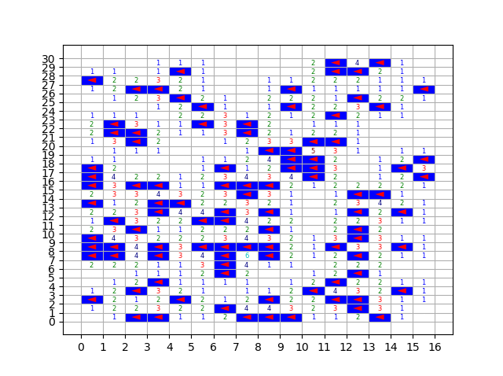

# Minesweeper Solver
A simple code that solves a minesweeper board. The solver uses 4 moves to try and find all the mines:
1) flag all adjacent cells if the number equals the number of adjacent cells
2) reveal all adjacent cells if the number of adjacent mines is satisfied
3) if two cells share some adjacent cells and one has a larger number, then flag the adjacent cells of the larger number
4) if one cell's adjacent cells are the superset of another cell's adjacent cells, then reveal the complement

## Example
An example of a successfully solved board, displayed using Matplotlib.

